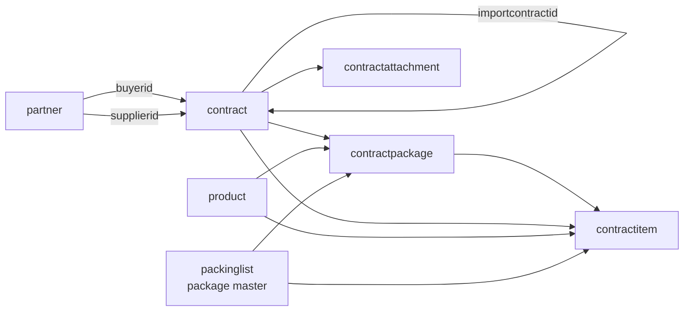

# IE_BO Database

Tai lieu nay la ban tom tat database dang dong bo voi code hien tai. Ban chi tiet tung bang, tung cot nam tai:

- [database_ver1.md](database_ver1.md)
- [database_diagram_ver1.md](database_diagram_ver1.md)

## Schema hien tai

Database su dung PostgreSQL schema `public`.

Nhom bang chinh:

- `partner`: danh muc doi tac, gom `CUSTOMER`, `SUPPLIER`, `SHIPPING`.
- `product`: danh muc san pham, co vat lieu, nam san xuat, ghi chu va D/R/C san pham.
- `productimage`: danh sach hinh anh san pham.
- `packinglist`: package master/loai kien trong luong API moi. `packinglist.id` la `packageId`.
- `contract`: header hop dong chung cho `IMPORT` va `EXPORT`, co `contracttype`, `buyerid`, `supplierid`, `importcontractid`, attachments.
- `contractpackage`: dong kien hang cho luong `EXPORT`, tham chieu `contract`, `packinglist`, `product`.
- `contractitem`: dong san pham/gia, duoc dung cho ca `IMPORT` va `EXPORT`.
- `contractattachment`: file dinh kem hop dong.
- `"user"`: tai khoan dang nhap, login bang `username/password`.

Nhom legacy/phase sau:

- `salesorder`, `salesorderitem`: don hang nen/legacy; `contract.salesorderid` hien nullable.
- `packinglistitem`: chi tiet packing legacy; luong contract moi khong dung bang nay.
- `proformainvoice`, `proformainvoiceitem`, `commercialinvoice`, `commercialinvoiceitem`, `payment`: nhom chung tu va thanh toan.

## Quan he chinh

## API lien quan

- Product: `api/Product/Get-Product/{productId}`, `api/Product/Search-Product`, `api/Product/Insert-Product`, `api/Product/Update-Product`, `api/Product/Delete-Product/{productId}`.
- Partner: `api/Partner/Get-Partner/{partnerId}`, `api/Partner/Search-Partner`, `api/Partner/Insert-Partner`, `api/Partner/Update-Partner/{partnerId}`.
- Package: `api/Package/Get-Package/{packageId}`, `api/Package/Search-Package`, `api/Package/Insert-Package`, `api/Package/Update-Package/{packageId}`, `api/Package/Delete-Package/{packageId}`.
- Contract: `api/Contract/Get-Contract/{contractId}`, `api/Contract/Search-Contract`, `api/Contract/Insert-Contract`, `api/Contract/Insert-Import-Contract`, `api/Contract/Insert-Contract-Attachment/{contractId}`.
- User: `api/User/Login`, `api/User/Refresh-Token`, `api/User/Revoke-Token`, `api/User/Logout/{userId}`, `api/User/Register-User`, `api/User/Update-User`, `api/User/Delete-User/{userId}`, `api/User/Activate-User/{userId}`.

## Luu y thiet ke

- Package trong code/API khong co bang rieng ten `package`; DB dung `packinglist`.
- `IMPORT` contract dung `supplierid` va `items[]`, khong lien quan den package.
- `EXPORT` contract dung `buyerid`, `packages[]`, va phai link den 1 `IMPORT` contract qua `importcontractid`.
- `contractitem` dang luu mot phan du lieu lap lai de query nhanh; voi `EXPORT` no tro toi `contractpackage`, voi `IMPORT` no luu dong san pham truc tiep.
- Cac bang co `delt` se dung soft delete voi gia tri `Y`.
- Audit columns chung: `createdby`, `createddate`, `updatedby`, `updateddate`.
