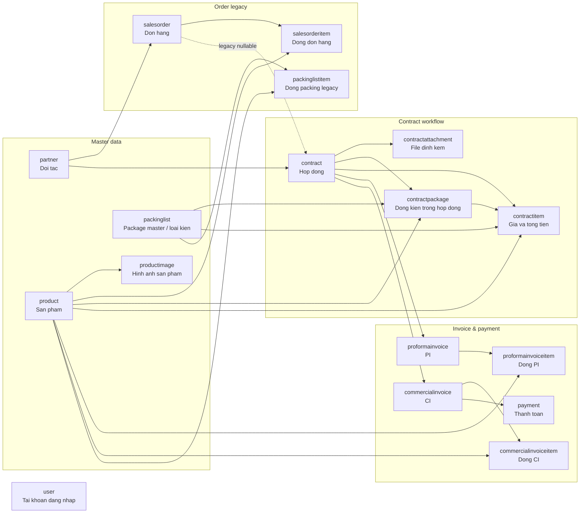
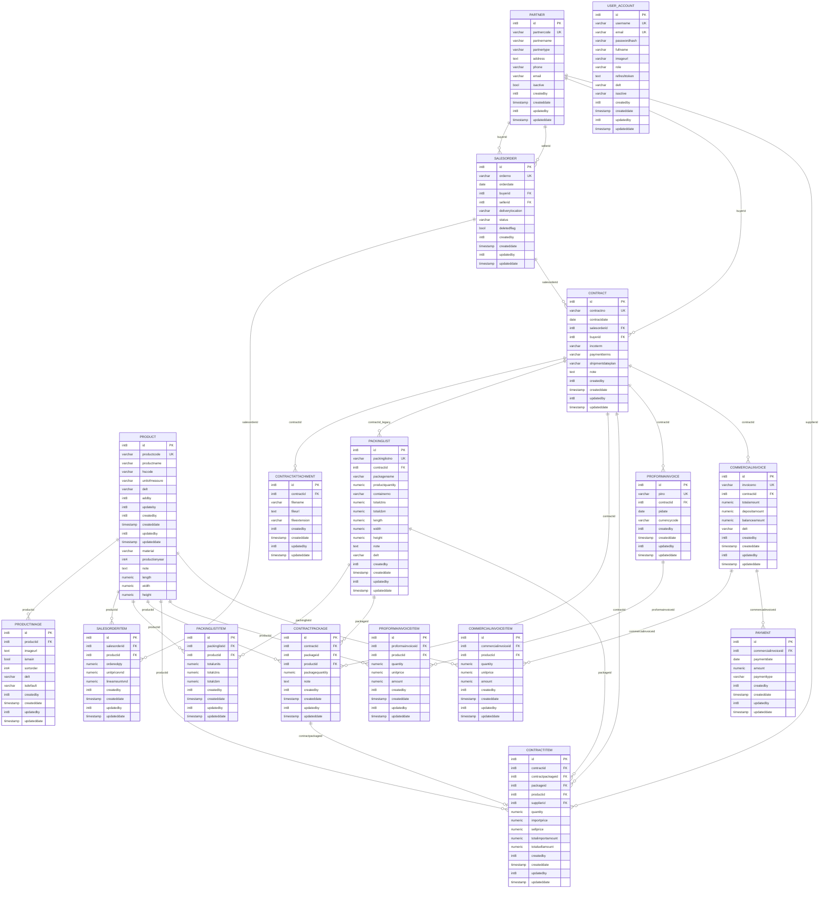

# Database Diagram Ver 1

Tai lieu nay mo hinh hoa database dua tren `database_ver1.md`.

## 1. So do tong quan module

## 2. ERD chi tiet

## 3. Ghi chu doc so do

- `USER_ACCOUNT` dai dien cho bang SQL `public."user"` vi `user` la keyword/ten dac biet.
- `PACKINGLIST` duoc dung nhu package master trong luong API hien tai.
- `PACKINGLISTITEM`, `SALESORDER`, `SALESORDERITEM` la cac phan legacy/nen nghiep vu.
- `CONTRACTPACKAGE` la dong kien hang trong hop dong.
- `CONTRACTITEM` la noi luu gia nhap, gia ban va tong tien theo dong kien/san pham.
